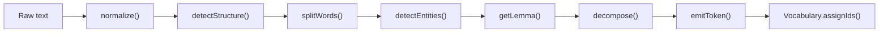

# CST Code Walkthrough

This document is for someone reading the repository as code, not as a paper.
It explains what lives where, which paths matter first, and how the main tokenizer turns text into CST tokens.

## What This Repository Actually Contains

At a high level, the repo has three related but distinct code paths:

1. `src/`: the TypeScript CST tokenizer, tests, small corpus-processing utilities, and demo entry points.
2. `edge/`: Python tokenizer implementations and edge-model assets for the browser demo and ONNX export path.
3. `reasoning/` and `training/`: research pipelines for reasoning datasets, model training, and evaluation.

If you only want to understand "how CST tokenization works," start in `src/tokenizer/`.

## Recommended Reading Order

Read the repo in this order:

1. [`README.md`](../README.md): project intent, token types, and top-level layout.
2. [`ARCHITECTURE.md`](../ARCHITECTURE.md): the two-level view of default CST tokens vs. reasoning tokens.
3. [`src/tokenizer/index.ts`](../src/tokenizer/index.ts): the real execution path for the TypeScript tokenizer.
4. [`src/tokenizer/emitter.ts`](../src/tokenizer/emitter.ts): the file that decides whether a word becomes `CMP`, `ROOT`, `REL`, or `LIT`.
5. [`src/tokenizer/semanticFields.ts`](../src/tokenizer/semanticFields.ts) and [`src/tokenizer/data.ts`](../src/tokenizer/data.ts): the lookup tables that make the tokenizer useful.
6. [`src/tests/examples.test.ts`](../src/tests/examples.test.ts): concrete expected behavior.

After that, decide whether you care about:

- `edge/` for the Python implementation and browser-facing artifacts.
- `reasoning/` for the higher-level projection/tokenization track.
- `training/` for experiments and paper reproduction.

## Mental Model

CST is not learning subword fragments. It tries to map each word to a typed semantic token:

- `CMP:<field>:<role>`: best case, both meaning and morphological role are known.
- `ROOT:<field>`: semantic field is known, but no role was detected.
- `REL:<relation>`: function/relational word such as a preposition or conjunction.
- `STR:<marker>`: sentence-level structure such as question, future, or negation.
- `LIT:<surface>`: fallback literal when the system cannot confidently structure the word.

The TypeScript tokenizer processes text in seven stages:

The important architectural point is that most "intelligence" in the current codebase comes from lookup tables and rules, not from a learned model inside the tokenizer.

## The Main Execution Path

### `src/tokenizer/index.ts`

`CSTTokenizer.tokenize()` is the best starting point because it wires every stage together.

The method does this, in order:

1. Normalize the text with `normalize()`.
2. Detect whole-sentence structure with `detectStructure()`.
3. Split the normalized text into word-like units.
4. Run named-entity detection before morphology so entities are preserved as literals.
5. For each word:
   - skip punctuation/noise fragments,
   - derive a lemma,
   - check whether it is part of a named entity,
   - decompose the word morphologically,
   - emit one CST token.
6. Assign integer vocabulary IDs.
7. Return the tokens, ids, and coverage stats.

Two details matter when reading this file:

- Structure tokens are emitted first, before per-word tokens.
- The tokenizer currently guarantees one emitted token per surviving word, plus any sentence-level `STR:*` tokens.

### Stage 1: normalization

[`src/tokenizer/normalizer.ts`](../src/tokenizer/normalizer.ts) is intentionally small.
It lowercases, normalizes smart quotes, collapses whitespace, and trims.

This tells you the current implementation is conservative: it is not doing aggressive Unicode canonicalization, transliteration, or punctuation rewriting beyond a narrow set of quote characters.

### Stage 2: sentence structure

[`src/tokenizer/structureDetector.ts`](../src/tokenizer/structureDetector.ts) scans the full normalized sentence for regex-based markers such as:

- question
- negation
- condition
- future
- past
- emphasis

This is the source of `STR:*` tokens.
Because it works at sentence scope, it can emit structure markers even when no individual word later becomes a structured content token.

### Stage 3: token splitting and lemmatization

Word splitting happens inside `splitWords()` in [`src/tokenizer/index.ts`](../src/tokenizer/index.ts).
It is a punctuation-based splitter, not a full parser.

Lemmatization also lives in `index.ts`, via `compromise`.
The code tries verbs first, then nouns, and falls back to the lowercased surface form.
That means several downstream behaviors depend heavily on how good the `compromise` lemma is for a given word.

### Stage 4: named entities

[`src/tokenizer/ner.ts`](../src/tokenizer/ner.ts) uses `compromise` to mark people, places, and organizations.
Anything recognized as an entity bypasses the morphology/semantic-field path and becomes `LIT:<surface>`.

The intent is simple: preserve proper names rather than force them into semantic fields.

### Stage 5: morphology

[`src/tokenizer/morphology.ts`](../src/tokenizer/morphology.ts) is rule-based.

It has:

- `PREFIX_ROLES`: maps prefixes like `un-`, `re-`, `pre-`, `mis-`.
- `SUFFIX_ROLES`: maps suffixes like `-er`, `-tion`, `-able`, `-ly`, `-ed`, `-s`.

`decompose(word, lemma)` returns:

- `root`: usually the lemma or a stem candidate.
- `role`: a morphological role such as `agent`, `instance`, `possible`, `repeat`, `plural`.

The logic is intentionally greedy and readable rather than linguistically exhaustive.
This is a rule engine for high-value English patterns, not a full morphological analyzer.

### Stage 6: semantic field resolution

The repo separates the semantic inventory from the word-to-field map:

- [`src/tokenizer/cst-spec.ts`](../src/tokenizer/cst-spec.ts): canonical field and role inventory.
- [`src/tokenizer/semanticFields.ts`](../src/tokenizer/semanticFields.ts): lemma-to-field mappings and lookup helpers.

This is one of the most important design choices in the project.
The tokenizer does not just stem words; it collapses many lexical variants onto a shared semantic field such as:

- `learn`, `study`, `discover` -> `know`
- `say`, `tell`, `explain` -> `speak`
- `travel`, `arrive`, `walk` -> `move`

In other words, this stage is where CST becomes semantic rather than merely morphological.

### Stage 7: token emission

[`src/tokenizer/emitter.ts`](../src/tokenizer/emitter.ts) is the decision engine.
Given the word, lemma, entity flag, and decomposition, it chooses the final token shape.

The decision order is:

1. Entity -> `LIT`
2. Number -> `ROOT:size`
3. Relation word -> `REL:*`
4. Function word -> `LIT:*`
5. Resolved field + role -> `CMP:*`
6. Resolved field only -> `ROOT:*`
7. Otherwise -> `LIT:*`

That ordering is worth understanding because it explains most behavior quickly:

- relation words win before semantic-field emission,
- function words do not become semantic fields,
- the difference between `CMP` and `ROOT` is just whether a role was found,
- unresolved content words fall back to literals rather than forced guesses.

## Vocabulary and IDs

[`src/tokenizer/vocabulary.ts`](../src/tokenizer/vocabulary.ts) is a small mutable registry.

It:

- reserves special tokens first,
- assigns IDs lazily as new token strings are encountered,
- stores token metadata and frequency,
- can save/load the vocabulary as JSON.

This means the tokenizer is not using a fixed published vocab inside `src/`.
The effective vocab is built from whichever corpus you process, then serialized next to that output.

## Data Tables Drive the Behavior

Two files explain a large share of the repository's practical behavior:

- [`src/tokenizer/data.ts`](../src/tokenizer/data.ts)
- [`src/tokenizer/semanticFields.ts`](../src/tokenizer/semanticFields.ts)

`data.ts` contains the relation map and function-word set.
`semanticFields.ts` contains a large hand-authored lemma-to-field map.

If tokenization quality looks surprising, these are the first files to inspect.
In practice, extending coverage usually means adding entries here, not rewriting the pipeline.

## Tests as Executable Spec

The test suite under [`src/tests/`](../src/tests/) is the shortest way to see intended behavior.

Useful files:

- [`examples.test.ts`](../src/tests/examples.test.ts): end-to-end expectations on sample sentences.
- [`structure.test.ts`](../src/tests/structure.test.ts): `STR:*` markers.
- [`morphology.test.ts`](../src/tests/morphology.test.ts): prefix/suffix decomposition.
- [`normalizer.test.ts`](../src/tests/normalizer.test.ts): text normalization.

These tests act more like behavioral anchors than exhaustive linguistic validation.

## Pipeline Utilities

The code in [`src/pipeline/`](../src/pipeline/) sits one layer above the tokenizer:

- [`process.ts`](../src/pipeline/process.ts): tokenizes a sentence corpus into training JSONL and writes the CST vocabulary.
- [`stats.ts`](../src/pipeline/stats.ts): coverage analysis and missed-word reporting.
- [`download.ts`](../src/pipeline/download.ts): corpus acquisition.
- [`stream.ts`](../src/pipeline/stream.ts): streaming helpers.

This is the bridge between a tokenizer library and a training dataset.
If you want to reproduce the "tokenize a corpus and inspect coverage gaps" workflow, this folder is the path.

## Python Edge Path

The repo also ships Python tokenizer implementations in [`edge/`](../edge/).

The key file for English is [`edge/english_tokenizer.py`](../edge/english_tokenizer.py).
It mirrors the TypeScript pipeline closely:

- same stage order,
- same JSON-based data tables from `data/tokenizer/`,
- same token categories,
- same parity-check story via [`scripts/check_tokenizer_parity.py`](../scripts/check_tokenizer_parity.py).

The practical difference is backend choice:

- TypeScript uses `compromise`.
- Python uses `spaCy`.

That matters because lemma/NER quality can differ even when the rule tables are shared.

## Reasoning Track

[`reasoning/`](../reasoning/) is not just "more training code."
It introduces a second tokenization level for reasoning-oriented models.

The core files are:

- [`reasoning/tokenizer/english.py`](../reasoning/tokenizer/english.py)
- [`reasoning/tokenizer/arabic.py`](../reasoning/tokenizer/arabic.py)
- [`reasoning/tokenizer/projection.py`](../reasoning/tokenizer/projection.py)

The pattern is:

1. Produce a richer default-level token stream.
2. Apply a projection step that removes surface-heavy tokens and keeps reasoning-relevant structure.

This part of the repo is closer to research infrastructure than to the base tokenizer library.

## Training and Experiment Code

[`training/`](../training/) contains scripts for reproducing or extending the paper-style experiments:

- CST corpus generation,
- SentencePiece/BPE baselines,
- GPT-2 training,
- ablations and multi-seed experiments.

This code is downstream of tokenization.
It is important for reproducing results, but it is not where you should start if the goal is to understand how a sentence becomes CST tokens.

## A Good "First 30 Minutes" Plan

If you are new to the codebase, this sequence gives the highest return:

1. Run `npx tsx src/demo.ts`.
2. Read [`src/tokenizer/index.ts`](../src/tokenizer/index.ts) top to bottom.
3. Read [`src/tokenizer/emitter.ts`](../src/tokenizer/emitter.ts) and [`src/tokenizer/morphology.ts`](../src/tokenizer/morphology.ts).
4. Skim [`src/tokenizer/semanticFields.ts`](../src/tokenizer/semanticFields.ts) to see how coverage is encoded.
5. Read [`src/tests/examples.test.ts`](../src/tests/examples.test.ts).
6. Run the coverage tooling on a small sentence set with [`src/pipeline/stats.ts`](../src/pipeline/stats.ts).

After that, you will understand the main implementation decisions.

## Things Easy to Miss

- The TypeScript tokenizer is simple by design. Its power comes from rule ordering and lookup tables.
- The repo contains both TypeScript and Python implementations; the Python side is not just a wrapper.
- `cst-spec.ts` defines the conceptual inventory, but practical runtime behavior depends heavily on the maps in `data.ts` and `semanticFields.ts`.
- The reasoning pipeline is a second layer on top of default CST tokenization, not a replacement for it.
- The test suite is useful for orientation, but the bigger research story lives in the docs and training folders.

## If You Want to Modify the Tokenizer

Use this rule of thumb:

- Add or fix field coverage: edit [`src/tokenizer/semanticFields.ts`](../src/tokenizer/semanticFields.ts).
- Add or fix relation words: edit [`src/tokenizer/data.ts`](../src/tokenizer/data.ts).
- Add or fix affix-role logic: edit [`src/tokenizer/morphology.ts`](../src/tokenizer/morphology.ts).
- Add new sentence-level markers: edit [`src/tokenizer/structureDetector.ts`](../src/tokenizer/structureDetector.ts).
- Change token-shape priority: edit [`src/tokenizer/emitter.ts`](../src/tokenizer/emitter.ts).

That is the shortest path to productive changes.